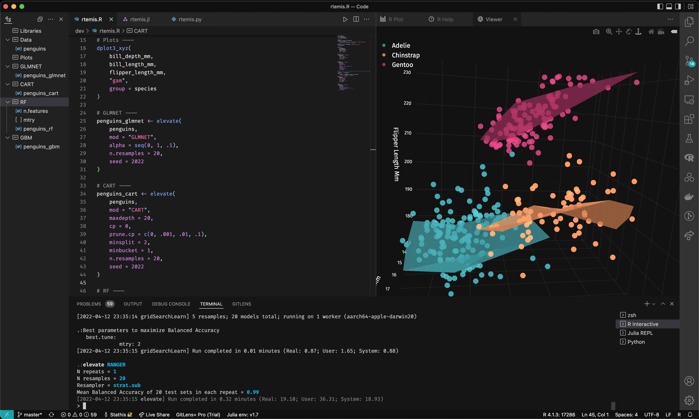

# rtemis-dark

__rtemis-dark__ [VS Code](https://code.visualstudio.com/) theme.

Because dark themes need the same little number under **R**, **G**, and **B**,
some purples, and a splash of teal.

Recommended font is Fira Code.

This is the preferred theme for [rtemis](https://github.com/egenn/rtemis).

