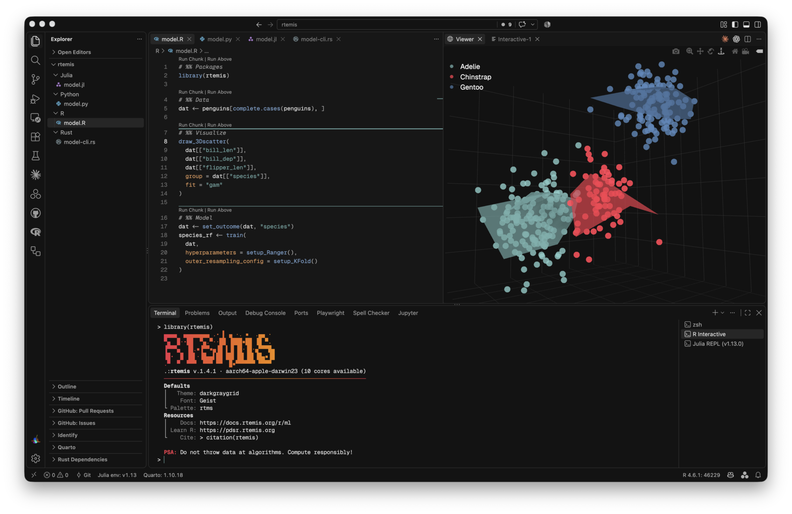
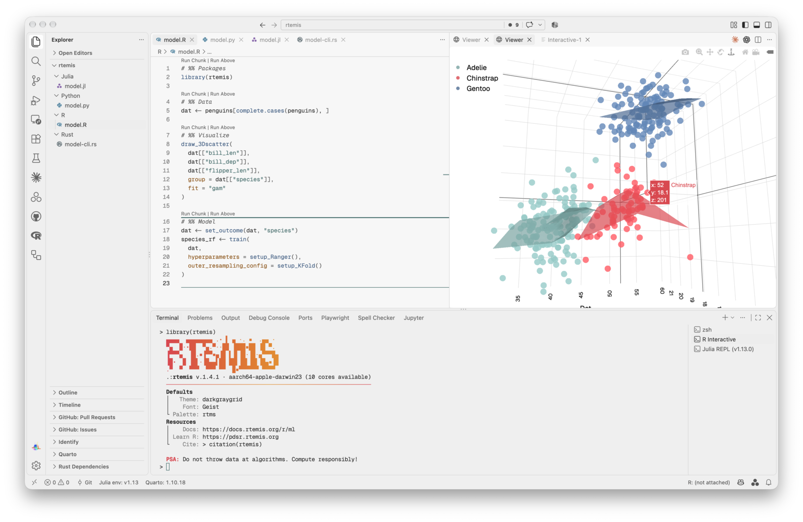

# rtemis VS Code themes

[__rtemis__](https://www.rtemis.org) [VS Code](https://code.visualstudio.com/) theme.

Includes `rtemis-dark` and `rtemis-light`.

Also, check out the [Firefox rtemis extension](https://addons.mozilla.org/en-US/firefox/addon/rtemis/)
